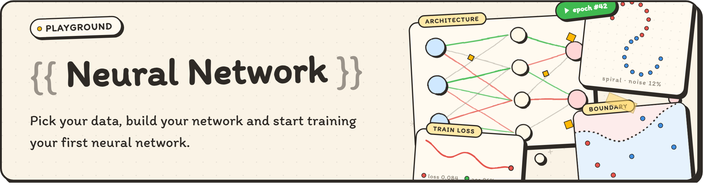
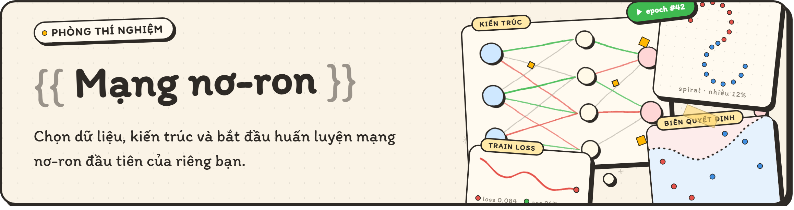

# Neural Network Playground

An interactive playground for exploring neural networks from the ground up.

Choose a dataset, build your first neural network, and watch it learn step by step.
See how the weights, loss, accuracy, and decision boundary evolve during training. You can also try different optimizers, batch sizes, learning rates, and weight initialization methods to discover how they influence the learning progress.

Best of all, there's nothing to install. Everything is ready to use in your browser.

-------------------------------

# Phòng thí nghiệm Mạng nơ-ron

Một ứng dụng tương tác trực quan khá hữu ích cho những ai đang tìm hiểu về mạng nơ-ron.

Hãy bắt đầu bằng việc chọn một tập dữ liệu thú vị, tạo ra một mạng đơn giản và huấn luyện trên tập dữ liệu đó. Bạn có thể xem giá trị mỗi cạnh trọng số, sự thay đổi giá trị loss, độ chính xác và biên quyết định trong quá trình huấn luyện. Bạn cũng có thể thử nghiệm các thuật toán tối ưu (SGD, Adam), kích thước batch, tốc độ học và bộ khởi tạo trọng số để xem cách chúng ảnh hưởng đến việc huấn luyện mô hình. 

Và tuyệt vời hơn nữa, bạn không cần cài đặt để bắt đầu sử dụng, chúng tôi đã triển khai sẵn công cụ tại đây để bạn truy cập. 

